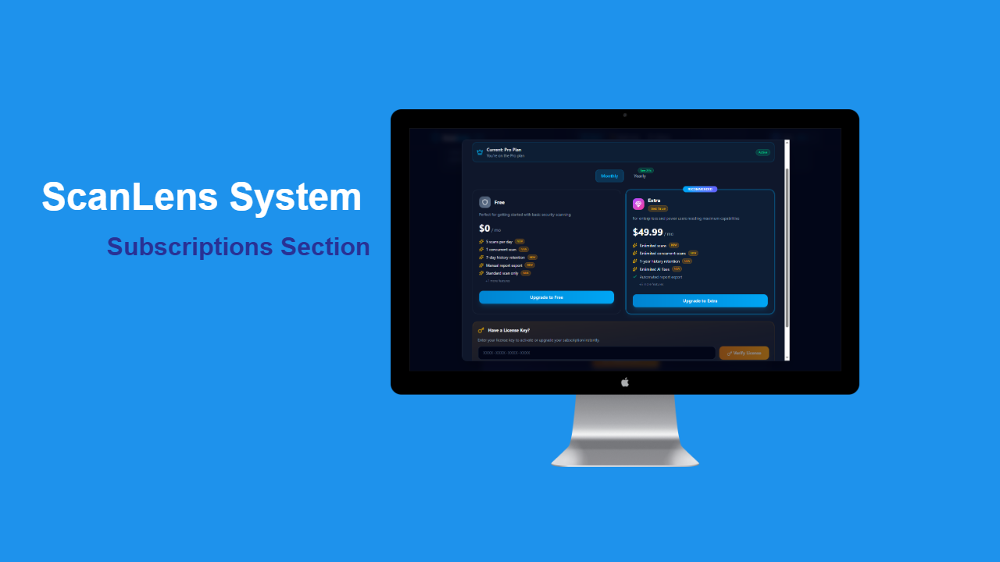
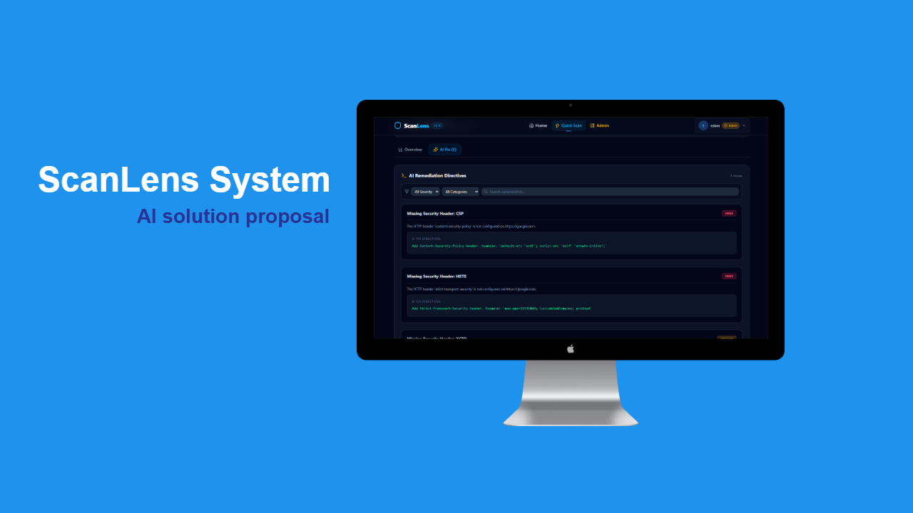

# ScanLens - Frontend

A modern, responsive web application built with **Next.js** and **TypeScript** for comprehensive security scanning and vulnerability assessment. The frontend provides an intuitive interface for users to manage scans, view reports, and handle subscriptions.


## 🚀 Quick Start

### Prerequisites

- **Node.js** 18.17 or higher
- **npm** or **yarn** package manager

### Installation

1. Clone the repository:

```bash
git clone <repository-url>
cd ScanLens/client
```

2. Install dependencies:

```bash
npm install
# or
yarn install
```

3. Create environment configuration (`.env.local`):

```env
NEXT_PUBLIC_API_URL=http://localhost:3000/api
```

4. Run development server:

```bash
npm run dev
# or
yarn dev
```

Visit `http://localhost:3000` in your browser.

## 📁 Project Structure

```
client/
├── app/                          # Next.js App Router pages
│   ├── layout.tsx               # Root layout wrapper
│   ├── page.tsx                 # Homepage
│   ├── admin/                   # Admin dashboard
│   ├── auth/                    # Authentication pages
│   │   ├── login/
│   │   ├── register/
│   │   ├── forgot-password/
│   │   └── verify/
│   ├── scan/                    # Scanning interface
│   ├── history/                 # Scan history & details
│   ├── subscription/            # Subscription management
│   ├── buy-license/             # License purchasing
│   ├── settings/                # User settings
│   └── help/                    # Help/documentation
├── components/                  # Reusable React components
│   └── layout/                  # Layout components
│       ├── Header.tsx
│       ├── Footer.tsx
│       └── UpgradeModal.tsx
├── lib/                         # Utility functions & helpers
│   ├── api.ts                   # API client configuration
│   ├── plans.config.ts          # Subscription plans data
│   └── guards/                  # Route protection
│       ├── withAuth.tsx         # Auth guard
│       ├── withAdmin.tsx        # Admin guard
│       └── withSubscription.tsx # Subscription guard
├── public/                      # Static assets
│   └── img/                     # Images directory
├── tailwind.config.ts           # Tailwind CSS configuration
├── tsconfig.json               # TypeScript configuration
├── next.config.ts              # Next.js configuration
├── eslint.config.mjs           # ESLint configuration
├── postcss.config.mjs          # PostCSS configuration
└── package.json                # Dependencies
```

## 🛠️ Development

### Build for production:

```bash
npm run build
npm run start
```

### Linting & Code Quality:

```bash
npm run lint
```

### Key Technologies

| Technology          | Purpose                                     |
| ------------------- | ------------------------------------------- |
| **Next.js 15+**     | React framework for SSR & static generation |
| **TypeScript**      | Type-safe development                       |
| **Tailwind CSS 4+** | Utility-first CSS framework                 |
| **React**           | UI component library                        |
| **Axios**           | HTTP client for API requests                |

## 🔐 Authentication & Authorization

The application includes protected routes using custom guards:

- **`withAuth`** - Requires user login
- **`withAdmin`** - Requires admin privileges
- **`withSubscription`** - Checks active subscription status

## 📊 Key Features

- 🔍 **Scan Management** - Create, view, and manage security scans
- 📈 **Detailed Reports** - Comprehensive vulnerability assessment reports
- 👥 **User Authentication** - Secure login and registration
- 💳 **Subscription Management** - Handle plans and billing
- ⚙️ **Settings** - Customizable user preferences
- 👨‍💼 **Admin Dashboard** - Manage users and system configuration

## 📸 Screenshots

### Dashboard



### Scan Results


### AI Recommendations



### Admin Panel


## 🤝 Contributing

We welcome contributions! Please follow our [CONTRIBUTING.md](./CONTRIBUTING.md) guidelines for:

- Code style standards
- Git workflow
- Pull request process
- Testing requirements

##  Backend Repository

Check out the **ScanLens Backend API** here:
👉 [ScanLens - Backend](https://github.com/eslam-cmd/ScanLens-server)


**Last Updated:** August 2026
